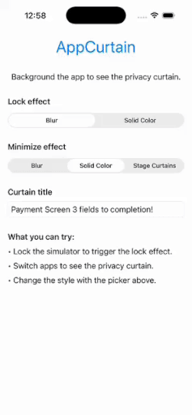

# AppCurtain



> Warning: This library is in a very early phase and is not ready for production use yet.

AppCurtain is a small iOS helper that shows a privacy curtain (blur or mask) when
your app leaves the foreground, and removes it when the app becomes active again.

## Features

- Automatic show/hide on app lifecycle transitions
- Blur, solid color, or custom view overlays
- Works with multi-scene apps via a configurable window provider

## Installation

Use Swift Package Manager to add the package to your app.

### Swift Package Manager (SPM)

In Xcode: File → Add Packages…, then paste:

```
https://github.com/deya-eldeen/AppCurtain
```

Select a version or branch (use `master` if you have no releases yet).

## Usage

UIKit (AppDelegate):

```swift
import UIKit
import AppCurtain

@main
final class AppDelegate: UIResponder, UIApplicationDelegate {
    func application(
        _ application: UIApplication,
        didFinishLaunchingWithOptions launchOptions: [UIApplication.LaunchOptionsKey: Any]?
    ) -> Bool {
        AppCurtain.shared.start(style: .blur(.systemChromeMaterial))
        return true
    }
}
```

SwiftUI (App + delegate adapter):

```swift
import SwiftUI
import AppCurtain

@main
struct AppCurtainExampleApp: App {
    @UIApplicationDelegateAdaptor(AppDelegate.self) var appDelegate

    var body: some Scene {
        WindowGroup {
            ContentView()
        }
    }
}

final class AppDelegate: NSObject, UIApplicationDelegate {
    func application(
        _ application: UIApplication,
        didFinishLaunchingWithOptions launchOptions: [UIApplication.LaunchOptionsKey: Any]? = nil
    ) -> Bool {
        AppCurtain.shared.start(style: .blur(.systemChromeMaterial))
        return true
    }
}
```

Custom style:

```swift
AppCurtain.shared.start(style: .color(.black))

AppCurtain.shared.start(style: .custom {
    let view = UIView()
    view.backgroundColor = .black
    return view
})
```

If your app has multiple scenes or custom window setup, pass a window provider:

```swift
AppCurtain.shared.start(windowProvider: {
    UIApplication.shared.connectedScenes
        .compactMap { $0 as? UIWindowScene }
        .first?.windows.first
})
```

Stop or update the curtain at runtime:

```swift
AppCurtain.shared.updateStyle(.blur(.systemMaterial))
AppCurtain.shared.stop()
```

## Xcode project

`AppCurtain.xcodeproj` is generated by XcodeGen using `project.yml`.
If you need to regenerate it, run:

```sh
xcodegen
```

## Example

See the `Example` folder for a small SwiftUI app skeleton that uses AppCurtain.
